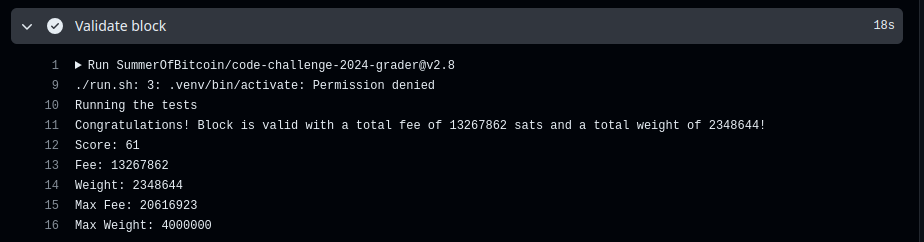

# SOLUTION.md

This document outlines my solution approach and implementation details for the Summer of Bitcoin 2024 challenge's mining task. I relied heavily on resources like learnmeabitcoin.com by Greg Walker, Kenn Shirrif's blogs, and the 'Mastering Bitcoin' book. Initially, I focused on understanding Bitcoin scripting techniques, particularly P2PKH and P2WPKH, which were essential for transaction validation. I began by implementing P2PKH and then extended the solution to support both P2WPKH and P2PKH by the end of the project. Unfortunately, due to time constraints, I was unable to implement P2SH scripting but intend to explore it in the future. The libraries I used included pycryptodome (for Autograder), ECDSA, hashlib, json, os, and struct.

## Design Approach:

To construct a valid block, I followed these key steps:

1. **Transaction Validation**: I parsed each transaction from the mempool folder and filtered them and For validation, I implemented a stack that performed OP_CODES operations in the script, moreover I needed to implement OP_CHECKSIG as a separate function which involved using ECSDSA library. I had to create another function to find message hash from serialized transaction data for both P2PKH(Legacy) and P2WPKH(Segwit) Transactions.After validation it created a directory where all the valid transaction were copied and stored for further usage in Mining process.

2. **Block Header Construction**: I constructed the block header by including the version number, previous block hash, Merkle root of the included transactions, timestamp, difficulty target, and nonce.

3. **Coinbase Transaction**: I created a coinbase transaction with the appropriate reward and included it as the first transaction in the block. I took the raw data from examples of coinbase in learnmeabitcoin.com (link in references)

4. **Merkle Root Calculation**: I calculated the Merkle root (found from Kenn Shirrif's Blog) by hashing the hashes of all included transactions until only one hash remained, which became the Merkle root. This involved finding txids and wtxids for both P2PKH (wtxid = txid in P2PKH) and P2WPKH Transactions.

5. **Block Hash Calculation**: I concatenated the block header fields and calculated the hash. I repeated this process by incrementing the nonce until the block hash met the required difficulty target that was specified in the challenge details. 

6. **Creating Output.txt**: As specified in the challenge details, a script `main.py` was created to run the simulation. It ended producing a output.txt file containing the Block.

## Results and Performance:

My solution successfully mined a block with the correct block header and included valid transactions. The efficiency of the solution was optimized by validating transactions individually and including only valid transactions in the block. Below is the screenshot from Autograder with details of my solution.

## Conclusion
In conclusion, the assignment strengthened my understanding of mining processes within bitcoin blockchain. In future I wish to implement the remaining transaction types. 

